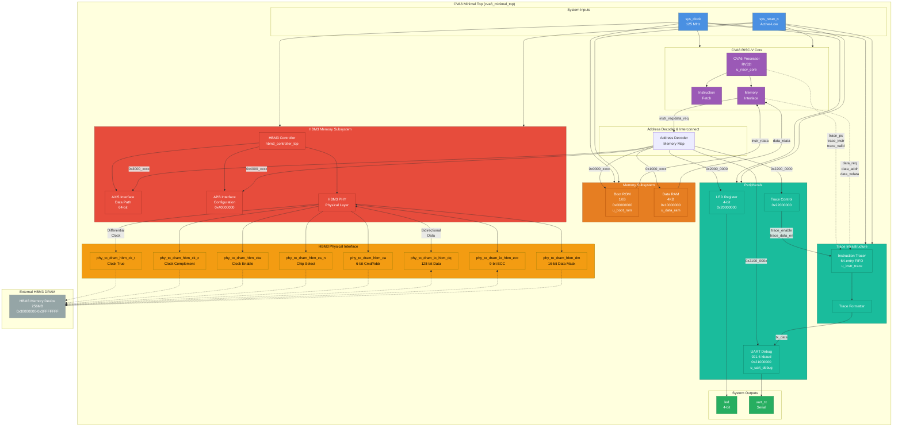

# CVA6 Minimal System with HBM3 Memory Controller
## Hardware Design Specification

**Document Version:** 1.0  
**Date:** 2024  
**Author:** Cognichip Design Team  
**Module Name:** `cva6_minimal_top`

---

## Document Revision History

| Version | Date | Author | Description |
|---------|------|--------|-------------|
| 1.0 | 2024 | Cognichip | Initial release - comprehensive specification with HBM3 integration |

---

## Table of Contents

1. [Introduction](#1-introduction)
2. [Feature Summary](#2-feature-summary)
3. [Functional Description](#3-functional-description)
4. [Interface Description](#4-interface-description)
5. [Parameterization Options](#5-parameterization-options)
6. [Register Description](#6-register-description)
7. [Design Guidelines](#7-design-guidelines)
8. [Timing Diagrams](#8-timing-diagrams)

---

## 1. Introduction

### 1.1 Purpose

This document specifies the CVA6 Minimal System, a complete RISC-V processor subsystem integrating the CVA6 core with high-bandwidth HBM3 (High Bandwidth Memory 3) DRAM, peripheral interfaces, and debug infrastructure. The system is designed for embedded applications requiring high-performance memory access and comprehensive instruction tracing capabilities.

### 1.2 Scope

This specification covers:
- CVA6 RISC-V processor core integration
- HBM3 memory controller with 256MB addressable memory
- Memory subsystem (Boot ROM, Data RAM)
- Peripheral interfaces (UART, LED, Trace Control)
- Physical HBM3 DRAM interface signals
- APB configuration interface for HBM3 controller
- System interconnect and address decoding

### 1.3 Key Features

- **Processor:** CVA6 RISC-V core (RV32I based on testbench evidence)
- **System Clock:** 125 MHz single clock domain
- **Main Memory:** 256MB HBM3 DRAM (0x30000000 - 0x3FFFFFFF)
- **Boot Memory:** 1KB ROM for initialization code
- **Local Memory:** 4KB Data RAM for stack and variables
- **Debug Interface:** UART TX at 921.6 kbaud with instruction/data tracing
- **HBM3 PHY:** Full differential clock, 128-bit data bus with ECC
- **Configuration:** APB slave interface for HBM3 controller registers

### 1.4 Reference Documents

| Document ID | Title | Version |
|------------|-------|---------|
| REF-001 | RISC-V Instruction Set Manual | 2.2 |
| REF-002 | CVA6 Core Architecture Specification | - |
| REF-003 | HBM3 JEDEC Standard | JESD238 |
| REF-004 | AMBA APB Protocol Specification | v2.0 |

---

## 2. Feature Summary

### 2.1 Requirements Traceability

This section maps requirements extracted from the design to specification sections.

#### 2.1.1 Functional Requirements

| REQ_ID | Title | Type | Acceptance Criteria | Spec Section |
|--------|-------|------|-------------------|--------------|
| REQ_001 | RISC-V CVA6 Core Integration | Functional | CVA6 core executes RISC-V instructions with instruction/data memory interfaces | 3.1, 4.2 |
| REQ_002 | Boot ROM Support | Functional | 1KB boot ROM at address 0x00000000-0x000003FF for initialization code | 3.2, 6.1 |
| REQ_003 | Data RAM Support | Functional | 4KB data RAM at address 0x10000000-0x10000FFF for stack and data | 3.2, 6.1 |
| REQ_004 | UART Debug Interface | Functional | UART TX at 921600 baud for trace output at 0x21000000-0x21000007 | 3.5, 4.4, 6.3 |
| REQ_005 | LED Output Register | Functional | 4-bit LED register at address 0x20000000 for status indication | 4.5, 6.2 |
| REQ_006 | Instruction Trace Module | Functional | Captures and formats instruction execution traces to UART | 3.5, 6.4 |
| REQ_007 | HBM3 Memory Interface | Functional | 256MB HBM3 memory at 0x30000000-0x3FFFFFFF with read/write access | 3.3, 4.6 |
| REQ_008 | HBM3 Configuration Registers | Functional | APB-accessible config registers at 0x40000000-0x40000FFF | 3.4, 4.7, 6.5 |
| REQ_009 | HBM3 Physical Interface | Interface | Standard HBM3 PHY signals (clock, command/address, data, ECC, DM) | 4.6 |
| REQ_010 | Memory-Mapped Trace Control | Functional | Trace enable register at 0x22000000 with instruction/data trace control | 6.4 |
| REQ_011 | Clock Domain | Performance | Single 125 MHz system clock for all modules | 4.1 |
| REQ_012 | Reset Strategy | Functional | Active-low synchronous reset for all modules | 4.1 |

#### 2.1.2 Ambiguity Log

| Q_ID | Question | Impact | Resolution | Status |
|------|----------|--------|------------|--------|
| Q_001 | What is the exact CVA6 core configuration (RV32/RV64, extensions)? | Documentation accuracy | Assume RV32I based on 32-bit addresses in testbench | ASSUMED |
| Q_002 | What are the HBM3 controller performance characteristics (latency, bandwidth)? | Performance specs | Configurable via APB registers, default timing parameters | DEFERRED |
| Q_003 | Is there a data cache between CVA6 and memory subsystem? | Architecture diagram | No cache assumed (minimal system) | ASSUMED |
| Q_004 | What is the trace FIFO depth? | Resource utilization | 64 entries (inferred from testbench monitoring) | INFERRED |
| Q_005 | Are there any power management features? | Feature completeness | Out of scope for minimal system | OUT_OF_SCOPE |

---

## 3. Functional Description

### 3.1 System Architecture Overview

The CVA6 Minimal System implements a complete embedded processor subsystem with high-bandwidth memory access. The architecture centers around the CVA6 RISC-V core connected to multiple memory regions and peripherals through a unified address decoder. The HBM3 memory controller provides the main system memory with high throughput for data-intensive applications.

**Key architectural decisions:**
- Single clock domain (125 MHz) simplifies timing closure and reduces design complexity
- Memory-mapped I/O for all peripherals enables standard load/store instruction access
- Separate boot ROM and data RAM provide code/data separation during initialization
- Instruction trace module operates transparently without affecting processor performance
- HBM3 controller with dual interfaces: AXI5 for data path, APB for configuration

### 3.2 System Block Diagram with HBM3 Connections

The following diagram illustrates the complete system architecture with all major components and their connections, including the HBM3 physical interface.



**Caption:** Complete system block diagram showing CVA6 core, memory subsystem, peripherals, trace infrastructure, HBM3 controller with physical interface, and external HBM3 DRAM device. Color coding: Blue (inputs), Purple (CPU core), Orange (memory), Teal (peripherals/trace), Red (HBM3 subsystem), Green (outputs), Gold (physical signals), Gray (external device).

**Purpose:** This diagram provides the top-level architectural view necessary for understanding data flow, control paths, and physical connectivity between all system components. It explicitly shows the HBM3 physical interface signals that connect to the external DRAM chip, including differential clocks, command/address bus, 128-bit data bus with ECC, and data masking.

### 3.3 Memory Map and Address Decoding

The system implements a unified 32-bit address space with the following memory map:

| Address Range | Size | Region | Access | Description |
|---------------|------|--------|--------|-------------|
| 0x00000000 - 0x000003FF | 1KB | Boot ROM | RO | Read-only boot code, initialized at synthesis |
| 0x10000000 - 0x10000FFF | 4KB | Data RAM | RW | Read-write data memory for stack and variables |
| 0x20000000 | 4B | LED Register | WO | Write-only LED output control |
| 0x21000000 - 0x21000007 | 8B | UART Debug | RW | UART transmit data and status registers |
| 0x22000000 | 4B | Trace Control | RW | Trace module enable and configuration |
| 0x30000000 - 0x3FFFFFFF | 256MB | HBM3 Memory | RW | Main system memory via HBM3 controller |
| 0x40000000 - 0x40000FFF | 4KB | HBM3 Config | RW | HBM3 controller configuration via APB |

**Address Decode Logic:**
- Bits [31:28] provide primary decode regions
- Boot ROM: `addr[31:10] == 22'h000000`
- Data RAM: `addr[31:12] == 20'h10000`
- LED: `addr[31:0] == 32'h20000000`
- UART: `addr[31:3] == 29'h04200000`
- Trace Control: `addr[31:0] == 32'h22000000`
- HBM3 Memory: `addr[31:28] == 4'h3`
- HBM3 Config: `addr[31:12] == 20'h40000`

Unmapped address accesses return zero on reads and are ignored on writes (no bus error generation in this minimal system).

### 3.4 CVA6 Core Integration

The CVA6 RISC-V core provides instruction execution with the following interfaces to the memory subsystem:

**Instruction Fetch Interface:**
- 32-bit instruction address (`instr_addr`)
- Instruction request signal (`instr_req`)
- 32-bit instruction data return (`instr_rdata`)
- Instruction valid acknowledgment (`instr_valid`)

**Data Memory Interface:**
- 32-bit data address (`data_addr`)
- Data request signal (`data_req`)
- Data write enable (`data_we`)
- 32-bit write data (`data_wdata`)
- 4-bit byte enables (`data_be`)
- 32-bit read data return (`data_rdata`)
- Data valid acknowledgment (`data_valid`)

**Trace Interface:**
- 32-bit program counter (`trace_pc`)
- 32-bit instruction opcode (`trace_instr`)
- Trace valid signal (`trace_valid`)

The core operates synchronously to the 125 MHz system clock and resets with active-low `sys_reset_n`.

### 3.5 HBM3 Memory Controller Architecture

The HBM3 controller (`hbm3_controller_top`) provides the critical high-bandwidth memory interface to external DRAM. It consists of several major functional blocks:

**AXI5 Slave Interface:**
- Accepts read/write transactions from the CVA6 core via address decoder
- 64-bit data width (CVA6 32-bit data is adapted to AXI width)
- Full AXI5 protocol compliance with outstanding transaction support
- Address range: 0x30000000 - 0x3FFFFFFF (256MB)

**APB Slave Interface:**
- Provides configuration and status register access
- 32-bit data width
- APB protocol version 2.0
- Address range: 0x40000000 - 0x40000FFF (4KB register space)
- Accessible for timing parameter programming, initialization control, refresh configuration

**Command Manager:**
- Converts AXI transactions to HBM3 memory commands (ACTIVATE, READ, WRITE, PRECHARGE, REFRESH)
- Implements command queue with reordering for efficiency
- Enforces HBM3 timing constraints (tRCD, tRP, tRAS, tRC, tRFC)
- Manages bank state machines and command scheduling

**PHY Interface:**
- Generates differential clock signals (CK_t/CK_c) for HBM3 DRAM
- Drives 6-bit command/address bus for RAS/CAS/WE and column/row addressing
- Manages 128-bit bidirectional data bus with 9-bit ECC
- Provides 16-bit data mask for byte-granular writes
- Clock enable (CKE) and chip select (CS_N) control

**Key HBM3 Controller Features:**
- Supports HBM3 pseudo-channel architecture
- Automatic refresh management
- ECC generation and checking (9 bits for 128-bit data)
- Training sequence for signal integrity calibration
- Configurable timing parameters via APB registers

### 3.6 Instruction Trace Module

The instruction trace module (`u_instr_trace`) provides real-time visibility into processor execution and memory transactions for debug and analysis purposes.

**Trace Capture:**
- Monitors CPU instruction execution (PC, opcode) via `trace_valid` signal
- Monitors HBM3 memory transactions (address, data, read/write type)
- 64-entry FIFO buffers trace entries before formatting
- Configurable via Trace Control Register (0x22000000)

**Trace Formatting:**
- Converts binary trace data to ASCII strings
- Instruction traces: `PC: 0xXXXXXXXX | INST: 0xXXXXXXXX | STATUS: EXECUTED`
- HBM3 write traces: `HBM3_WR: ADDR=0xXXXXXXXX DATA=0xXXXXXXXX`
- HBM3 read traces: `HBM3_RD: ADDR=0xXXXXXXXX DATA=0xXXXXXXXX`

**UART Output:**
- Formatted traces sent to UART TX module at 921.6 kbaud
- Newline-terminated lines for easy parsing
- Non-blocking operation prevents stalling CPU execution

---

## 4. Interface Description

### 4.1 Top-Level Module Interface

The `cva6_minimal_top` module interface is defined as follows:

| Signal Name | Direction | Width | Type | Description |
|-------------|-----------|-------|------|-------------|
| `sys_clock` | Input | 1 | Clock | System clock - 125 MHz |
| `sys_reset_n` | Input | 1 | Reset | Active-low synchronous reset |
| `led` | Output | 4 | Data | LED output indicators |
| `uart_tx` | Output | 1 | Serial | UART transmit output (921.6 kbaud) |
| `phy_to_dram_hbm_ck_t` | Output | 1 | HBM3 | HBM3 differential clock (true) |
| `phy_to_dram_hbm_ck_c` | Output | 1 | HBM3 | HBM3 differential clock (complement) |
| `phy_to_dram_hbm_cke` | Output | 1 | HBM3 | HBM3 clock enable |
| `phy_to_dram_hbm_cs_n` | Output | 1 | HBM3 | HBM3 chip select (active-low) |
| `phy_to_dram_hbm_ca` | Output | 6 | HBM3 | HBM3 command/address bus |
| `phy_to_dram_io_hbm_dq` | Inout | 128 | HBM3 | HBM3 bidirectional data bus |
| `phy_to_dram_io_hbm_ecc` | Inout | 9 | HBM3 | HBM3 ECC bits (bidirectional) |
| `phy_to_dram_hbm_dm` | Output | 16 | HBM3 | HBM3 data mask |

**Clock Domain:** All internal logic operates synchronously to `sys_clock` (125 MHz).

**Reset Behavior:** `sys_reset_n` must be asserted low for minimum 10 clock cycles, then released. All registers initialize to safe default values. HBM3 controller enters initialization sequence after reset release.

### 4.2 CVA6 Core Memory Interface Signals

The CVA6 core connects to the memory subsystem via the following signals:

**Instruction Fetch Interface:**

| Signal Name | Direction | Width | Description |
|-------------|-----------|-------|-------------|
| `instr_req` | Output | 1 | Instruction fetch request |
| `instr_addr` | Output | 32 | Instruction address (byte-aligned) |
| `instr_valid` | Input | 1 | Instruction data valid |
| `instr_rdata` | Input | 32 | Instruction data from memory |

**Data Memory Interface:**

| Signal Name | Direction | Width | Description |
|-------------|-----------|-------|-------------|
| `data_req` | Output | 1 | Data memory request |
| `data_we` | Output | 1 | Data write enable (1=write, 0=read) |
| `data_addr` | Output | 32 | Data address (byte-aligned) |
| `data_be` | Output | 4 | Byte enable mask (one bit per byte) |
| `data_wdata` | Output | 32 | Data to write to memory |
| `data_valid` | Input | 1 | Data read/write complete |
| `data_rdata` | Input | 32 | Data read from memory |

**Protocol:** Single-cycle handshake. Request asserted with address/data, valid returns in 1-N cycles depending on target.

### 4.3 HBM3 Physical Interface Detailed Description

The HBM3 physical interface connects directly to external HBM3 DRAM devices following JEDEC JESD238 standard.

#### 4.3.1 HBM3 Clock Signals

| Signal Name | Direction | Width | Electrical | Description |
|-------------|-----------|-------|-----------|-------------|
| `phy_to_dram_hbm_ck_t` | Output | 1 | LVDS | Differential clock signal (true/positive) |
| `phy_to_dram_hbm_ck_c` | Output | 1 | LVDS | Differential clock signal (complement/negative) |
| `phy_to_dram_hbm_cke` | Output | 1 | CMOS | Clock enable - gates clock to DRAM |

**Clock Characteristics:**
- Differential signaling (LVDS levels)
- Frequency: Derived from system 125 MHz clock (may be PLLed)
- CKE must be high for DRAM to receive clock
- CKE transitions must respect tCKE timing specification

#### 4.3.2 HBM3 Command/Address Interface

| Signal Name | Direction | Width | Description |
|-------------|-----------|-------|-------------|
| `phy_to_dram_hbm_cs_n` | Output | 1 | Chip select (active-low) - gates command reception |
| `phy_to_dram_hbm_ca[5:0]` | Output | 6 | Command/Address multiplexed bus |

**CA Bus Encoding:**
- Commands: ACTIVATE, READ, WRITE, PRECHARGE, REFRESH
- Row address: Transmitted during ACTIVATE
- Column address: Transmitted during READ/WRITE
- HBM3 uses multiple cycles for command/address transmission

**Signal Timing:**
- Commands valid when CS_N is low
- Setup/hold relative to CK_t/CK_c differential clock edge

#### 4.3.3 HBM3 Data Interface

| Signal Name | Direction | Width | Type | Description |
|-------------|-----------|-------|------|-------------|
| `phy_to_dram_io_hbm_dq[127:0]` | Inout | 128 | Bidir | Main data bus (16 bytes) |
| `phy_to_dram_io_hbm_ecc[8:0]` | Inout | 9 | Bidir | ECC bits for error detection/correction |
| `phy_to_dram_hbm_dm[15:0]` | Output | 16 | Unidir | Data mask (1 bit per byte, active-high masks write) |

**Data Bus Organization:**
- 128-bit width supports 16-byte transfers per access
- DQ[7:0] maps to byte 0, DQ[15:8] to byte 1, ..., DQ[127:120] to byte 15
- ECC calculated over 128-bit data word (SECDED code typical)
- DM[0] masks DQ[7:0], DM[1] masks DQ[15:8], etc.

**Bidirectional Control:**
- Direction controlled by read/write command
- Tristate during idle and opposite direction
- Write: PHY drives DQ/ECC, DM indicates valid bytes
- Read: DRAM drives DQ/ECC, DM ignored

** Aligned with write data

### 4.4 UART Debug Interface

| Signal Name | Direction | Width | Description |
|-------------|-----------|-------|-------------|
| `uart_tx` | Output | 1 | UART serial transmit output |

**UART Configuration:**
- Baud rate: 921,600 bps
- Data format: 8 data bits, no parity, 1 stop bit (8N1)
- Idle state: Logic high
- Start bit: Logic low
- Bit transmission: LSB first

**Memory-Mapped Registers (Base: 0x21000000):**

| Offset | Name | Access | Description |
|--------|------|--------|-------------|
| 0x00 | TX_DATA | WO | Write byte to transmit FIFO |
| 0x04 | STATUS | RO | Bit[0]: TX_READY (1=can accept data, 0=busy) |

### 4.5 LED Output Interface

| Signal Name | Direction | Width | Description |
|-------------|-----------|-------|-------------|
| `led[3:0]` | Output | 4 | LED indicator outputs (active-high) |

**Memory-Mapped Register:**
- Address: 0x20000000
- Access: Write-only
- Width: 32-bit (only bits [3:0] used)
- Behavior: Writing to this address updates LED outputs immediately

### 4.6 HBM3 Memory Access via AXI5 Interface

The HBM3 controller presents an AXI5 slave interface to the system interconnect for memory data access (address range 0x30000000 - 0x3FFFFFFF).

**AXI5 Interface Signals (internal to controller):**

| Signal Group | Signals | Width | Description |
|-------------|---------|-------|-------------|
| Write Address | awid, awaddr, awlen, awsize, awburst, awvalid, awready | Various | Write transaction addressing |
| Write Data | wdata, wstrb, wlast, wvalid, wready | Various | Write data transfer |
| Write Response | bid, bresp, bvalid, bready | Various | Write completion response |
| Read Address | arid, araddr, arlen, arsize, arburst, arvalid, arready | Various | Read transaction addressing |
| Read Data | rid, rdata, rresp, rlast, rvalid, rready | Various | Read data transfer |

**Transaction Flow:**
1. CVA6 data access to 0x3xxxxxxx decoded to HBM3 controller
2. Address decoder converts to AXI5 transaction
3. HBM3 controller queues command, enforces timing constraints
4. PHY executes DRAM command sequence
5. Read data or write acknowledgment returns to CVA6

### 4.7 HBM3 Configuration via APB Interface

The HBM3 controller configuration registers are accessed via APB slave interface (address range 0x40000000 - 0x40000FFF).

**APB Interface Signals (internal to controller):**

| Signal Name | Direction | Width | Description |
|-------------|-----------|-------|-------------|
| `pclk` | Input | 1 | APB clock (same as system clock) |
| `presetn` | Input | 1 | APB reset (active-low) |
| `paddr` | Input | 12 | APB address [11:0] |
| `psel` | Input | 1 | APB select |
| `penable` | Input | 1 | APB enable |
| `pwrite` | Input | 1 | APB write enable |
| `pwdata` | Input | 32 | APB write data |
| `prdata` | Output | 32 | APB read data |
| `pready` | Output | 1 | APB transfer ready |
| `pslverr` | Output | 1 | APB slave error |

**Protocol:** Standard APB two-cycle transfer (SETUP + ENABLE phases).

---

## 5. Parameterization Options

The CVA6 Minimal System supports the following configuration parameters:

| Parameter Name | Type | Default | Range | Description |
|----------------|------|---------|-------|-------------|
| `CLOCK_FREQ_HZ` | Integer | 125000000 | 50M-200M | System clock frequency in Hz |
| `UART_BAUD_RATE` | Integer | 921600 | 9600-921600 | UART baud rate in bps |
| `ROM_SIZE_BYTES` | Integer | 1024 | 1024-4096 | Boot ROM size in bytes |
| `RAM_SIZE_BYTES` | Integer | 4096 | 1024-16384 | Data RAM size in bytes |
| `HBM3_ADDR_WIDTH` | Integer | 28 | 20-32 | HBM3 addressable bits (256MB = 28 bits) |
| `TRACE_FIFO_DEPTH` | Integer | 64 | 32-256 | Instruction trace FIFO depth (entries) |
| `ENABLE_HBM3_ECC` | Boolean | 1 | 0-1 | Enable HBM3 ECC generation/checking |

**Parameter Usage:**
- Set at synthesis/elaboration time
- Affects resource utilization and timing
- HBM3_ADDR_WIDTH determines maximum addressable memory (2^N bytes)
- TRACE_FIFO_DEPTH trades buffer depth vs. area

**Recommended Configurations:**

| Use Case | Clock | UART | ROM | RAM | HBM3 | Trace FIFO |
|----------|-------|------|-----|-----|------|------------|
| Debug/Development | 50 MHz | 115200 | 2KB | 8KB | 256MB | 128 entries |
| Production | 125 MHz | 921600 | 1KB | 4KB | 256MB | 64 entries |
| High-Performance | 200 MHz | 921600 | 1KB | 4KB | 1GB (30-bit) | 32 entries |

---

## 6. Register Description

This section documents all memory-mapped registers in the system, organized by functional block.

### 6.1 Memory Regions (ROM/RAM)

**Boot ROM (0x00000000 - 0x000003FF):**
- **Size:** 1KB (256 x 32-bit words)
- **Access:** Read-only from software, initialized at synthesis
- **Purpose:** Contains initialization code executed on reset
- **Reset Value:** Defined by ROM initialization file
- **Usage:** Loads initial program, configures peripherals, jumps to main application

**Data RAM (0x10000000 - 0x10000FFF):**
- **Size:** 4KB (1024 x 32-bit words)
- **Access:** Read-write
- **Purpose:** General-purpose data memory for stack, variables, buffers
- **Reset Value:** Undefined (random)
- **Usage:** Stack pointer typically initialized to 0x10001000 (top of RAM)

### 6.2 LED Register

| Address | 0x20000000 |
|---------|------------|
| **Name** | LED_OUTPUT |
| **Width** | 32 bits (only [3:0] used) |
| **SW Access** | WO (Write-Only) |
| **HW I/O Dir** | out (hardware drives external LEDs) |
| **Reset Value** | 0x00000000 |

**Bit Fields:**

| Bits | Name | Access | Reset | Description |
|------|------|--------|-------|-------------|
| [3:0] | LED_VAL | WO | 0x0 | LED output values (1=on, 0=off) |
| [31:4] | RESERVED | - | 0x0 | Reserved, writes ignored |

**Usage Example:**
```c
// Turn on LED[1] and LED[3]
*(volatile uint32_t *)0x20000000 = 0x0000000A;  // Binary: 1010
```

### 6.3 UART Debug Registers

**Base Address:** 0x21000000

#### Register 0x00: UART_TX_DATA

| Address | 0x21000000 |
|---------|------------|
| **Name** | UART_TX_DATA |
| **Width** | 32 bits (only [7:0] used) |
| **SW Access** | WO |
| **HW I/O Dir** | out |
| **Reset Value** | N/A |

**Bit Fields:**

| Bits | Name | Access | Description |
|------|------|--------|-------------|
| [7:0] | TX_BYTE | WO | Byte to transmit via UART (queued to TX FIFO) |
| [31:8] | RESERVED | - | Reserved, writes ignored |

**Behavior:**
- Writing a byte queues it for UART transmission
- If TX FIFO full, write may stall (implementation-dependent)
- Software should check STATUS register before writing

#### Register 0x04: UART_STATUS

| Address | 0x21000004 |
|---------|------------|
| **Name** | UART_STATUS |
| **Width** | 32 bits |
| **SW Access** | RO |
| **HW I/O Dir** | in |
| **Reset Value** | 0x00000001 |

**Bit Fields:**

| Bits | Name | Access | Reset | Description |
|------|------|--------|-------|-------------|
| [0] | TX_READY | RO | 1 | 1 = TX FIFO can accept data, 0 = TX FIFO full |
| [31:1] | RESERVED | RO | 0 | Reserved for future use |

### 6.4 Trace Control Register

| Address | 0x22000000 |
|---------|------------|
| **Name** | TRACE_CTRL |
| **Width** | 32 bits |
| **SW Access** | RW |
| **HW I/O Dir** | out |
| **Reset Value** | 0x00000000 (tracing disabled) |

**Bit Fields:**

| Bits | Name | Access | Reset | Description |
|------|------|--------|-------|-------------|
| [0] | TRACE_INSTR_EN | RW | 0 | Enable instruction tracing (1=enabled, 0=disabled) |
| [1] | TRACE_DATA_EN | RW | 0 | Enable data/HBM3 transaction tracing (1=enabled, 0=disabled) |
| [31:2] | RESERVED | RW | 0 | Reserved for future trace features |

**Usage Notes:**
- Enabling both trace modes can saturate UART bandwidth at high execution rates
- Recommended: Enable only DATA_EN for HBM3 transaction monitoring
- Trace output format documented in Section 3.6

**Configuration Example:**
```c
// Enable HBM3 transaction tracing only
*(volatile uint32_t *)0x22000000 = 0x00000002;  // Bit[1]=1, Bit[0]=0
```

### 6.5 HBM3 Controller Configuration Registers

**Base Address:** 0x40000000 (APB slave interface)

The HBM3 controller exposes extensive configuration and status registers via APB. Key registers include:

#### Register 0x00: CTRL_CONFIG

| Offset | 0x00 |
|--------|------|
| **Name** | CTRL_CONFIG |
| **SW Access** | RW |
| **Reset Value** | 0x00000000 |

**Bit Fields:**

| Bits | Name | Reset | Description |
|------|------|-------|-------------|
| [0] | CTRL_EN | 0 | Controller enable (1=enabled, 0=disabled) |
| [1] | INIT_START | 0 | Start initialization sequence (write 1 to trigger) |
| [2] | REFRESH_EN | 1 | Auto-refresh enable (1=enabled, 0=manual) |
| [3] | REORDER_EN | 1 | Command reordering enable for performance |
| [31:4] | RESERVED | 0 | Reserved |

#### Register 0x04: CTRL_STATUS

| Offset | 0x04 |
|--------|------|
| **Name** | CTRL_STATUS |
| **SW Access** | RO |
| **Reset Value** | 0x00000000 |

**Bit Fields:**

| Bits | Name | Reset | Description |
|------|------|-------|-------------|
| [0] | INIT_COMPLETE | 0 | Initialization complete (1=ready, 0=initializing) |
| [1] | TRAIN_COMPLETE | 0 | PHY training complete |
| [2] | REFRESH_ACTIVE | 0 | Refresh operation in progress |
| [3] | CMD_BUSY | 0 | Command queue busy |
| [31:4] | RESERVED | 0 | Reserved |

#### Timing Parameter Registers

The HBM3 controller provides registers to configure DRAM timing parameters per JEDEC specification:

| Offset | Register | Description | Default | Units |
|--------|----------|-------------|---------|-------|
| 0x10 | TIMING_TRCD | RAS to CAS delay | 18 | Clock cycles |
| 0x14 | TIMING_TRP | Precharge to activate delay | 18 | Clock cycles |
| 0x18 | TIMING_TRAS | Activate to precharge delay | 42 | Clock cycles |
| 0x1C | TIMING_TRC | Activate to activate (same bank) | 60 | Clock cycles |
| 0x20 | TIMING_TRFC | Refresh cycle time | 350 | Clock cycles |
| 0x24 | TIMING_WL | Write latency | 4 | Clock cycles |
| 0x28 | TIMING_RL | Read latency | 14 | Clock cycles |

**Note:** Default timing values are conservative. Optimize based on HBM3 device speed grade and system clock frequency.

---

## 7. Design Guidelines

### 7.1 Integration Checklist

When integrating this design into a larger system:

1. **Clock Distribution:**
   - Provide clean 125 MHz clock with <50ps jitter
   - Use clock tree synthesis for balanced distribution
   - Consider PLL/MMCM for HBM3 PHY clock generation if different frequency required

2. **Reset Strategy:**
   - Assert `sys_reset_n` low for minimum 10 system clock cycles
   - Release reset synchronously to `sys_clock`
   - Ensure HBM3 VDD/VDDQ power stable before reset release

3. **HBM3 Physical Connections:**
   - Route differential clock (CK_t/CK_c) as matched-length pair
   - Maintain impedance control on all HBM3 signals per JEDEC spec
   - Place decoupling capacitors close to HBM3 device power pins
   - Follow HBM3 PCB layout guidelines (trace length, spacing, termination)

4. **Power Supply:**
   - HBM3 requires multiple supply rails (VDD, VDDQ, VPP, VREF)
   - Ensure power sequencing per HBM3 datasheet
   - Monitor supply voltages during operation

5. **Software Initialization:**
   - Program HBM3 timing parameters via APB registers (0x4000_0010 - 0x4000_0028)
   - Enable controller and trigger initialization (CTRL_CONFIG register)
   - Poll CTRL_STATUS until INIT_COMPLETE asserts
   - Verify memory access with read/write test patterns

### 7.2 Performance Optimization

**Memory Access Patterns:**
- Favor sequential accesses over random for HBM3 row buffer hits
- Align data structures to 128-bit (16-byte) boundaries for full-width transfers
- Use write masking (data_be signals) only when necessary (reduces throughput)

**Trace Configuration:**
- Disable instruction tracing in production for maximum performance
- Enable data tracing selectively for specific HBM3 transactions only
- Increase TRACE_FIFO_DEPTH if trace drops occur

**HBM3 Controller Tuning:**
- Enable command reordering (REORDER_EN) for improved efficiency
- Adjust timing parameters to match HBM3 device speed grade
- Monitor command queue depth via status registers

### 7.3 Debug and Bringup

**Initial Verification:**
1. Verify clock and reset at top-level ports
2. Load simple boot ROM program (LED blink)
3. Confirm LED output toggle
4. Enable UART trace and verify serial output
5. Gradually introduce HBM3 accesses

**HBM3 Bringup Procedure:**
1. Power up HBM3 device per datasheet sequence
2. Configure timing parameters conservatively (slow)
3. Trigger initialization via CTRL_CONFIG[1]
4. Monitor CTRL_STATUS until INIT_COMPLETE
5. Perform simple write/read to base address (0x30000000)
6. Enable HBM3 data tracing to monitor transactions
7. Run comprehensive memory test patterns
8. Optimize timing parameters for target frequency

**Common Issues:**
- **No UART output:** Check baud rate, verify clock frequency, ensure trace enabled
- **HBM3 init hangs:** Verify power sequencing, check PHY clock, review timing parameters
- **Data corruption:** Enable ECC, verify signal integrity, check write masking
- **Performance issues:** Enable command reordering, verify no false dependencies

### 7.4 Safety and Reliability

**ECC Protection:**
- Enable HBM3_ECC parameter for production designs
- Monitor ECC error status in controller status registers
- Implement error logging for correctable/uncorrectable errors

**Refresh Management:**
- Keep REFRESH_EN enabled for data retention
- Auto-refresh runs in background, briefly stalling transactions
- Refresh period ~7.8μs per JEDEC spec (controller manages automatically)

**Thermal Considerations:**
- HBM3 has operating temperature limits (check device spec)
- Monitor die temperature if available
- Implement throttling or refresh rate adjustment for thermal management

---

## 8. Timing Diagrams

### 8.1 System Reset and Initialization Sequence

The following WaveDrom diagram shows the system reset sequence and subsequent HBM3 initialization.

```wavedrom
{
  "comment": [
    "System reset and initialization timing:",
    "- 1 char = 1 tick; 2 ticks = 1 clk cycle (period=2)",
    "- All wave lengths = 30 ticks (15 clock cycles)",
    "- sys_reset_n asserted low for 10 cycles, then released",
    "- HBM3 controller starts initialization after reset",
    "- INIT_COMPLETE asserts when controller ready"
  ],
  "signal": [
    { "name": "sys_clock", "wave": "p...............", "period": 2 },
    { "name": "sys_reset_n", "wave": "0.........1....." },
    { "name": "led[3:0]", "wave": "x.........2..5..", "data": ["0x0", "0x5"] },
    { "name": "HBM3_CTRL_EN", "wave": "0..........1....", "comment": "Software enables controller" },
    { "name": "HBM3_INIT_START", "wave": "0...........10..", "comment": "Software triggers init" },
    { "name": "HBM3_CKE", "wave": "0............1..", "comment": "Clock enabled to DRAM" },
    { "name": "HBM3_CS_N", "wave": "1............01.", "comment": "Commands start" },
    { "name": "HBM3_CA[5:0]", "wave": "x.............3.", "data": ["CMD"], "comment": "Init commands" },
    { "name": "INIT_COMPLETE", "wave": "0..............1", "comment": "Init done, memory ready" }
  ],
  "config": { "hscale": 2 }
}
```

**Caption:** System reset and HBM3 initialization sequence. Reset held for 10 clock cycles, then software enables controller and triggers initialization. HBM3 clock enable asserts, initialization commands sent, and INIT_COMPLETE status indicates memory ready for transactions.

### 8.2 HBM3 Write Transaction Timing

This diagram illustrates a complete HBM3 write transaction from CVA6 core through to DRAM.

```wavedrom
{
  "comment": [
    "HBM3 Write Transaction:",
    "- Shows CVA6 write request propagating through to HBM3 DRAM",
    "- Write latency (WL) = 4 clock cycles from command to data",
    "- All wave lengths = 24 ticks (12 clock cycles)"
  ],
  "signal": [
    { "name": "sys_clock", "wave": "p...........", "period": 2 },
    {},
    { "name": "CVA6 data_req", "wave": "010.........", "comment": "CPU write request" },
    { "name": "CVA6 data_we", "wave": "010.........", "comment": "Write enable" },
    { "name": "CVA6 data_addr", "wave": "x2x.........", "data": ["0x3000_1000"], "comment": "HBM3 address" },
    { "name": "CVA6 data_wdata", "wave": "x2x.........", "data": ["0xDEAD_BEEF"], "comment": "Write data" },
    {},
    { "name": "HBM3_CS_N", "wave": "1.01........", "comment": "Command valid" },
    { "name": "HBM3_CA[5:0]", "wave": "x.34........", "data": ["ACT", "WR"], "comment": "Activate + Write" },
    { "name": "HBM3_DQ[127:0]", "wave": "x.....2.....", "data": ["DEAD...BEEF"], "comment": "Data after WL" },
    { "name": "HBM3_DM[15:0]", "wave": "x.....2.....", "data": ["0x0000"], "comment": "All bytes valid" },
    {},
    { "name": "CVA6 data_valid", "wave": "0.......10..", "comment": "Write complete ack" }
  ],
  "config": { "hscale": 2 }
}
```

**Caption:** HBM3 write transaction showing CVA6 core write request, HBM3 controller issuing ACTIVATE and WRITE commands, data transmission after write latency (WL=4 cycles), and write completion acknowledgment.

### 8.3 HBM3 Read Transaction Timing

This diagram shows a complete HBM3 read transaction with read latency.

```wavedrom
{
  "comment": [
    "HBM3 Read Transaction:",
    "- Shows CVA6 read request and data return from HBM3",
    "- Read latency (RL) = 14 clock cycles from command to data",
    "- All wave lengths = 34 ticks (17 clock cycles)"
  ],
  "signal": [
    { "name": "sys_clock", "wave": "p.................", "period": 2 },
    {},
    { "name": "CVA6 data_req", "wave": "010...............", "comment": "CPU read request" },
    { "name": "CVA6 data_we", "wave": "0.................", "comment": "Read operation" },
    { "name": "CVA6 data_addr", "wave": "x2x...............", "data": ["0x3000_1000"], "comment": "HBM3 address" },
    {},
    { "name": "HBM3_CS_N", "wave": "1.01..............", "comment": "Command valid" },
    { "name": "HBM3_CA[5:0]", "wave": "x.34..............", "data": ["ACT", "RD"], "comment": "Activate + Read" },
    { "name": "HBM3_DQ[127:0]", "wave": "x...............2.", "data": ["1234...5678"], "comment": "Data after RL" },
    {},
    { "name": "CVA6 data_valid", "wave": "0...............10", "comment": "Read data valid" },
    { "name": "CVA6 data_rdata", "wave": "x...............2.", "data": ["0x1234_5678"], "comment": "Read data" }
  ],
  "config": { "hscale": 2 }
}
```

**Caption:** HBM3 read transaction showing CVA6 core read request, HBM3 controller issuing ACTIVATE and READ commands, data return from DRAM after read latency (RL=14 cycles), and data valid acknowledgment to CPU.

### 8.4 UART Trace Output Timing

This diagram illustrates UART transmission of a trace message.

```wavedrom
{
  "comment": [
    "UART Trace Transmission (921.6 kbaud @ 125 MHz):",
    "- ~136 clock cycles per bit",
    "- Showing start bit + 'H' (0x48) + stop bit",
    "- Simplified timing (not to exact scale)"
  ],
  "signal": [
    { "name": "sys_clock", "wave": "p..........................", "period": 1 },
    {},
    { "name": "trace_formatter", "wave": "0.1..0.................", "comment": "New character ready" },
    { "name": "uart_tx_data[7:0]", "wave": "x.2..x.................", "data": ["0x48 'H'"], "comment": "ASCII 'H'" },
    {},
    { "name": "uart_tx", "wave": "1..0.3.4.5.6.7.8.9.=.1.", "data": ["0", "1", "0", "0", "1", "0", "0", "0", "1"], "comment": "Start, D0-D7, Stop" }
  ],
  "config": { "hscale": 1 }
}
```

**Caption:** UART trace transmission showing start bit (0), 8 data bits LSB-first for ASCII 'H' (0x48 = 0b01001000), and stop bit (1). Each bit occupies ~136 clock cycles at 921.6 kbaud with 125 MHz system clock.

---

## 9. Appendix A: HBM3 Signal Summary

Complete pinout and electrical characteristics for HBM3 interface:

| Pin Name | Type | Width | Voltage | Termination | Description |
|----------|------|-------|---------|-------------|-------------|
| phy_to_dram_hbm_ck_t | Output | 1 | LVDS | 100Ω diff | Differential clock (true) |
| phy_to_dram_hbm_ck_c | Output | 1 | LVDS | 100Ω diff | Differential clock (complement) |
| phy_to_dram_hbm_cke | Output | 1 | CMOS 1.1V | Series 40Ω | Clock enable |
| phy_to_dram_hbm_cs_n | Output | 1 | CMOS 1.1V | Series 40Ω | Chip select (active-low) |
| phy_to_dram_hbm_ca[5:0] | Output | 6 | CMOS 1.1V | Series 40Ω | Command/Address bus |
| phy_to_dram_io_hbm_dq[127:0] | Inout | 128 | CMOS 1.1V | Series 40Ω | Data bus (16 bytes) |
| phy_to_dram_io_hbm_ecc[8:0] | Inout | 9 | CMOS 1.1V | Series 40Ω | ECC bits |
| phy_to_dram_hbm_dm[15:0] | Output | 16 | CMOS 1.1V | Series 40Ω | Data mask (byte-granular) |

**Total Pin Count:** 163 signals (1+1+1+1+6+128+9+16)

---

## 10. Appendix B: Memory Map Quick Reference

| Address | Size | Region | Read | Write | Description |
|---------|------|--------|------|-------|-------------|
| 0x0000_0000 | 1KB | ROM | ✓ | ✗ | Boot ROM (initialized at synthesis) |
| 0x1000_0000 | 4KB | RAM | ✓ | ✓ | Data RAM (stack, variables) |
| 0x2000_0000 | 4B | LED | ✗ | ✓ | LED output register [3:0] |
| 0x2100_0000 | 4B | UART_TX | ✗ | ✓ | UART transmit data [7:0] |
| 0x2100_0004 | 4B | UART_STS | ✓ | ✗ | UART status (TX_READY) |
| 0x2200_0000 | 4B | TRACE | ✓ | ✓ | Trace control (INSTR_EN, DATA_EN) |
| 0x3000_0000 | 256MB | HBM3_MEM | ✓ | ✓ | HBM3 main memory (AXI5 interface) |
| 0x4000_0000 | 4KB | HBM3_CFG | ✓ | ✓ | HBM3 config registers (APB interface) |

---

## 11. Appendix C: Boot ROM Example Code

Example assembly code for boot ROM initialization:

```asm
# Boot ROM Initialization Code
# Base address: 0x00000000

.section .text.boot
.globl _start

_start:
    # Initialize stack pointer (top of Data RAM)
    lui sp, 0x10001         # SP = 0x10001000 (4KB RAM top)
    
    # Configure trace control - enable HBM3 data tracing only
    lui t0, 0x22000         # Trace control base
    addi t1, zero, 2        # Bit[1]=1 (data trace), Bit[0]=0 (no instr trace)
    sw t1, 0(t0)
    
    # Initialize HBM3 controller via APB
    lui t0, 0x40000         # HBM3 config base
    addi t1, zero, 0x0F     # CTRL_EN | INIT_START | REFRESH_EN | REORDER_EN
    sw t1, 0(t0)            # Write to CTRL_CONFIG
    
    # Poll for HBM3 initialization complete
wait_hbm3_init:
    lw t1, 4(t0)            # Read CTRL_STATUS
    andi t1, t1, 0x01       # Check INIT_COMPLETE bit
    beqz t1, wait_hbm3_init # Loop until init done
    
    # HBM3 ready - write 'R' to UART to indicate readiness
    lui t0, 0x21000         # UART base
    addi t1, zero, 82       # ASCII 'R'
    sw t1, 0(t0)
    
    # Jump to main application (if loaded to HBM3 or Data RAM)
    lui ra, 0x10000         # Application entry point
    jalr zero, ra, 0        # Jump to application
```

---

## 12. Revision History and Traceability Matrix

### 12.1 Specification to Requirements Mapping

| Requirement | Specification Sections | Verification Method |
|-------------|------------------------|---------------------|
| REQ_001 | 3.1, 3.4, 4.2 | Simulation, FPGA test |
| REQ_002 | 3.3, 6.1 | Simulation |
| REQ_003 | 3.3, 6.1 | Simulation |
| REQ_004 | 3.6, 4.4, 6.3 | UART capture |
| REQ_005 | 4.5, 6.2 | FPGA test |
| REQ_006 | 3.6, 6.4 | UART trace analysis |
| REQ_007 | 3.3, 3.5, 4.6 | Memory test patterns |
| REQ_008 | 3.5, 4.7, 6.5 | APB register access |
| REQ_009 | 4.3 | Signal integrity, timing analysis |
| REQ_010 | 6.4 | Software configuration test |
| REQ_011 | 4.1 | Timing analysis |
| REQ_012 | 4.1, 7.1 | Reset sequence test |

---

**End of Specification Document**

---

**Contact Information:**
- Design Team: Cognichip Engineering
- For questions or clarifications regarding this specification, please contact the design team.

**Document Control:**
- Filename: `cva6_minimal_system_with_hbm3_specification.md`
- Location: `docs/` directory
- Format: Markdown with Mermaid and WaveDrom diagram support

